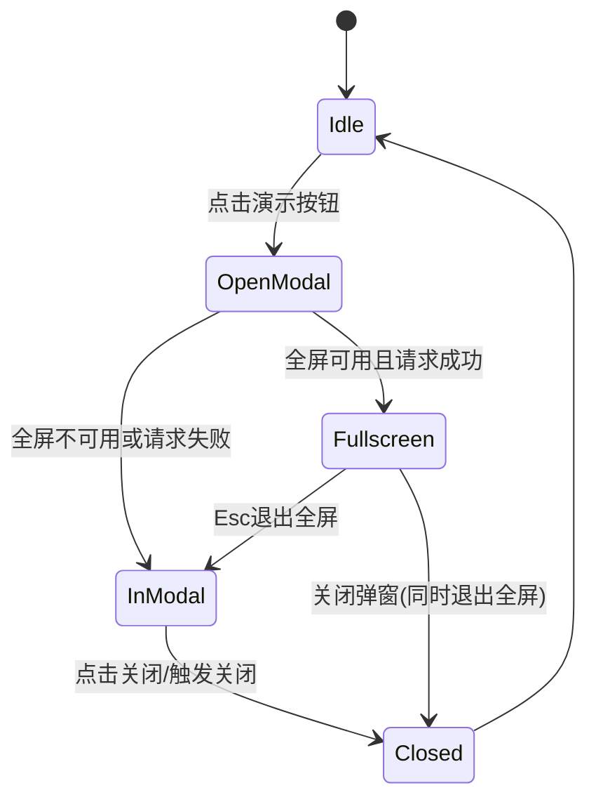

# vitepress-slidev-preview 需求分析与开发拆解

## 1. 目标

为 VitePress 页面增加 Slidev 演示能力：

- 当识别到某个 `.md` 文件 frontmatter 中存在 `slidev: true` 时，将该页面视为 **Slidev 页面**。
- 仅在 Slidev 页面上展示 `演示` 按钮。
- 点击 `演示` 按钮后，进入全屏演示；按 `Esc` 可退出全屏。
- 退出全屏后（或未全屏场景），在一个弹窗容器中继续演示，可手动关闭弹窗。

插件核心流程：

- 识别 slidev md 文件
- 打包时预处理
- 页面运行时可演示

## 2. 范围与非范围

### 范围

- 识别文档级 frontmatter 的 `slidev: true`。
- 在页面级注入演示入口（按钮）。
- 演示容器与全屏行为管理。
- 运行时关闭与退出逻辑。

### 非范围（当前阶段不做）

- Slidev 编辑器能力（在线改稿、双向同步）。
- 演示录制、批注、远程控制。
- 复杂主题深度定制（仅保留基础样式扩展点）。

## 3. 功能需求（拆解）

### 3.1 Slidev 文件识别

- 输入：页面 `.md` 的 frontmatter。
- 识别规则：
  - `slidev: true` => 识别为 Slidev 页面。
  - 其他值（缺失、false、字符串）默认按非 Slidev 页面处理。
- 输出：页面级标记（例如 `isSlidevPage`），供后续构建和运行时使用。

### 3.2 打包时预处理

- 在 VitePress 构建管线中，对识别到的 Slidev 页面进行预处理。
- 预处理目标：
  - 提取或构建演示所需数据（slides 内容、元信息、资源引用）。
  - 注入页面运行时需要的最小元数据（如是否展示按钮、演示数据入口）。
  - 保持普通 markdown 页面无额外开销。
- 预处理原则：
  - 对非 Slidev 页面零侵入。
  - 对 Slidev 页面构建结果可被运行时直接消费。

### 3.3 页面演示入口（按钮）

- 显示条件：仅在 `isSlidevPage === true` 的页面显示 `演示` 按钮。
- 按钮行为：
  - 点击后启动演示流程。
  - 若浏览器支持全屏 API，优先进入全屏。
  - 按钮支持可配置位置（默认页面右上角或阅读区工具栏）。

### 3.4 演示容器与交互

- 容器形式：弹窗（Modal / Dialog）。
- 基本能力：
  - 可承载 Slidev 演示内容。
  - 可关闭（右上角关闭按钮、遮罩点击按配置决定、`Esc` 键）。
- 全屏策略：
  - 进入演示时尝试 `requestFullscreen`。
  - 用户按 `Esc` 退出全屏后，弹窗容器仍保留，继续演示。
  - 用户关闭弹窗时结束演示并清理状态。
- 兼容策略：
  - 不支持全屏 API 时，直接使用弹窗容器演示。

## 4. 状态机（建议）

## 5. 技术实现建议（按阶段）

### 阶段 A：识别与标记

- 在 markdown/页面数据处理中读取 frontmatter。
- 产出统一标记：`isSlidevPage`。
- 在渲染上下文中可访问该标记。

### 阶段 B：构建预处理

- 为 `isSlidevPage` 页面生成演示所需数据入口。
- 统一注入运行时消费字段（例如 `__SLIDEV_PREVIEW__`）。
- 保障构建缓存和增量更新行为稳定。

### 阶段 C：运行时 UI 与演示

- 增加页面级 `演示` 按钮组件。
- 增加 `SlidevPreviewModal` 容器组件。
- 接入全屏 API 与 `fullscreenchange` 事件。
- 处理 `Esc`、关闭、销毁时清理。

### 阶段 D：可配置项

- 开放插件选项（建议）：
  - `buttonText`（默认：`演示`）
  - `buttonPlacement`
  - `closeOnMask`
  - `preferFullscreen`

## 6. 验收标准（DoD）

- 标注 `slidev: true` 的页面出现 `演示` 按钮；其他页面不出现。
- 点击 `演示` 后能进入演示模式：
  - 支持全屏时进入全屏。
  - `Esc` 后退出全屏但弹窗仍可继续演示。
- 可通过关闭按钮关闭弹窗，关闭后状态恢复干净。
- 构建产物中仅 Slidev 页面包含预处理数据。
- 无明显控制台报错，基本样式和交互可用。

## 7. 风险与注意点

- VitePress 与 Slidev 数据结构差异可能导致解析边界问题。
- 全屏 API 在不同浏览器权限/手势限制下行为不一致，需要兜底。
- 页面切换时需确保演示实例被正确销毁，避免内存泄漏。
- SSR 与客户端水合阶段需避免状态不一致。

## 8. 下一步执行清单

1. 定义 `slidev: true` 的识别入口与数据结构。
2. 实现打包预处理并注入运行时元数据。
3. 落地 `演示` 按钮 + 弹窗容器 + 全屏联动。
4. 添加最小可用测试（识别、按钮显示、Esc/关闭行为）。

