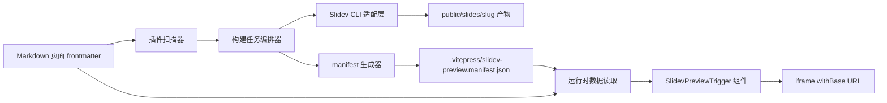
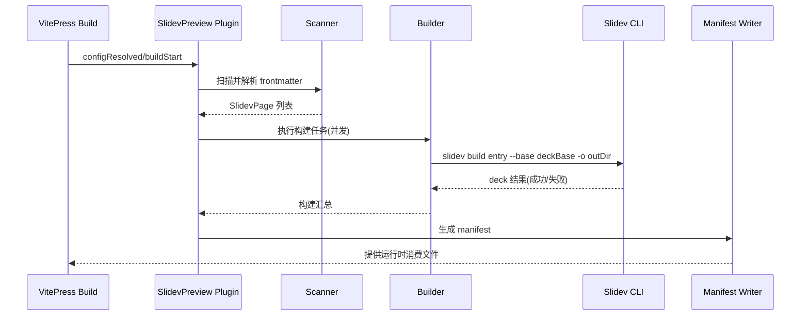

# VitePress Slidev Preview 插件 TDD（重新规划版）

> 目标：抛开当前实现细节，基于集成思路重新设计一个可发布、可扩展、可测试的插件方案。

## 1. 设计原则

- 以插件为中心：用户只安装并注册插件，不手写分散脚本。
- 构建与运行时解耦：构建期负责产出 deck，运行时仅消费 manifest。
- 与宿主低耦合：尽量不入侵用户主题结构，提供清晰扩展点。
- 子路径优先：任何 URL 生成都基于 VitePress `base`，默认兼容 GitHub Pages。
- 可观测与可恢复：失败可定位、可跳过、可重试，不因单 deck 失败拖垮全量构建。

## 2. 一句话方案

在 VitePress 构建前，插件扫描启用页面并调用 Slidev CLI 构建静态产物到 `public/slides/<slug>/`，同时生成 `manifest`；运行时组件根据页面 frontmatter + manifest 渲染触发器，并以 iframe 加载 `withBase('/slides/<slug>/index.html')`。

## 3. 系统架构



## 4. 模块拆分（包内）

| 模块 | 职责 | 输入 | 输出 |
| --- | --- | --- | --- |
| `node/scanner` | 扫描文档并解析 frontmatter | docs 根目录、include/exclude | `SlidevPage[]` |
| `node/slug` | 统一 slug/base/path 规则 | `relativePath`、用户覆盖配置 | `slug`、`deckBase`、`iframePath` |
| `node/builder` | 并发构建 deck、失败收集 | `SlidevPage[]`、CLI 选项 | 产物目录、构建结果 |
| `node/manifest` | 写入运行时消费数据 | 构建结果、页面元信息 | manifest JSON |
| `node/plugin` | 暴露 VitePress 插件入口 | 用户配置 | 构建 hook、virtual module |
| `runtime/trigger` | 文档页触发器与弹层 UI | frontmatter + manifest | iframe 预览体验 |
| `runtime/client` | 运行时工具（状态、错误提示） | manifest | 组件辅助能力 |
| `shared/types` | 类型定义 | - | Node/Runtime 共用类型 |

## 5. 对外配置设计

```ts
export interface SlidevPreviewOptions {
  include?: string[]            // 默认 ["**/*.md"]
  exclude?: string[]            // 默认 ["node_modules/**", ".vitepress/**"]
  root?: string                 // 文档扫描根目录，默认 VitePress 源目录
  outDir?: string               // 默认 "public/slides"
  manifestPath?: string         // 默认 ".vitepress/slidev-preview.manifest.json"
  clean?: boolean               // 构建前清空 outDir，默认 true
  concurrency?: number          // 并发度，默认 CPU 核数 - 1（最小 1）
  failOnError?: boolean         // 有 deck 失败时是否中断，默认 true
  frontmatterKey?: string       // 默认 "slidev"
  resolveEntry?: (page: string, fm: Record<string, any>) => string
  resolveSlug?: (page: string, fm: Record<string, any>) => string
}
```

frontmatter 约定（首版）：

- `slidev: boolean`：是否启用预览能力。
- `slidevSrc?: string`：deck 入口（相对页面路径）。
- `slidevSlug?: string`：自定义输出 slug。
- `slidevTitle?: string`：按钮文本。
- `slidevDisabled?: boolean`：仅保留元数据，不渲染入口（用于灰度或权限场景）。

## 6. 构建流程（从零实现）



关键约束：

- 构建顺序固定：`slidev assets -> vitepress build`。
- `deckBase` 计算规则唯一来源，Node 与 Runtime 必须共用同一实现。
- URL 永远显式落到 `index.html`，避免 dev server 目录回落差异。
- 支持 `--dry-run`（仅扫描和打印计划，不执行构建）用于排障。

## 7. 运行时交互规划

- 仅在页面满足 `slidev: true` 且 manifest 中有对应项时展示触发器。
- 触发器支持三种模式：`inline`（文档内）、`modal`（弹层）、`fullscreen`（全屏）。
- iframe 加载失败时显示错误态，并给出可复制 URL（便于排查 base/404）。
- 键盘冲突处理：弹层激活时，优先交给 iframe；关闭时归还给文档页。
- 对无 JS 场景提供降级链接（直接打开 deck 地址）。

## 8. 测试策略（TDD 落地）

### 8.1 单元测试（Vitest）

- `slug/base` 规则：`/`、`/repo/`、多层路径、中文/空格路径、重复斜杠。
- frontmatter 解析：合法、缺失、类型错误、冲突字段优先级。
- manifest 序列化：字段完整性、稳定排序、向后兼容字段保留。
- 错误映射：CLI 退出码与插件错误类型映射是否正确。

### 8.2 集成测试

- 构造最小 VitePress fixture，跑一次完整构建，断言：
  - 产物存在 `public/slides/<slug>/index.html`
  - `dist` 中 deck 路径可访问
  - 文档页包含触发器和正确 iframe URL
- 子路径构建：`VITEPRESS_BASE=/repo/` 下快照对比。
- 多 deck 并发构建：验证失败隔离和日志输出。

### 8.3 端到端测试（Playwright）

- 点击触发器打开弹层并加载 deck 成功。
- 全屏切换、关闭恢复、焦点与滚动恢复。
- deck 404 时展示错误提示且不影响文档主体浏览。

## 9. 里程碑拆解（按优先级）

| 里程碑 | 范围 | 交付物 |
| --- | --- | --- |
| M1 核心可用 | 扫描 + 构建 + manifest + 基础 trigger | 可跑通单 deck 预览 |
| M2 可靠性 | 错误体系、并发控制、日志、dry-run | 可定位问题并稳定 CI |
| M3 体验增强 | modal/fullscreen、失败态、无 JS 降级 | 可发布给真实用户试用 |
| M4 产品化 | 配置文档、模板脚手架、兼容性矩阵 | 可复用插件方案 |

## 10. 风险与预案

| 风险 | 触发场景 | 预案 |
| --- | --- | --- |
| Slidev 版本变更导致 CLI 参数不兼容 | 升级依赖后构建失败 | 增加 CLI 适配层 + 版本探测 |
| deck 构建耗时过高 | 多页面并发构建 | 缓存命中（entry hash）+ 增量构建 |
| base 配置不一致 | CI 与本地环境不同 | 强制校验 `VITEPRESS_BASE` 并在日志高亮 |
| 文档语法与 Slidev 解析冲突 | VP 专有语法进 deck | 引导使用 `slidevSrc` 分离入口 |

## 11. 验收标准

- 使用者只需注册插件和 frontmatter，即可完成“构建 + 预览”闭环。
- 在根路径与子路径部署下，iframe 均可正确加载 deck。
- 任一 deck 构建失败时，日志能定位到页面、入口文件与 CLI 输出。
- 关键路径有自动化测试覆盖（单元 + 集成 + E2E）。
- 清理与增量策略可控，不产生陈旧产物污染。
